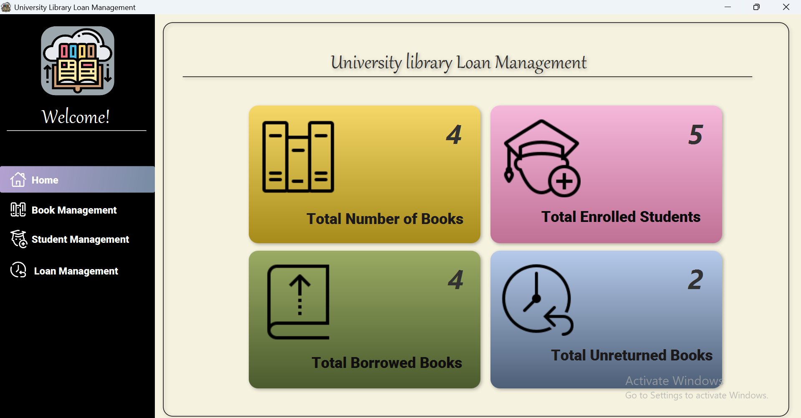
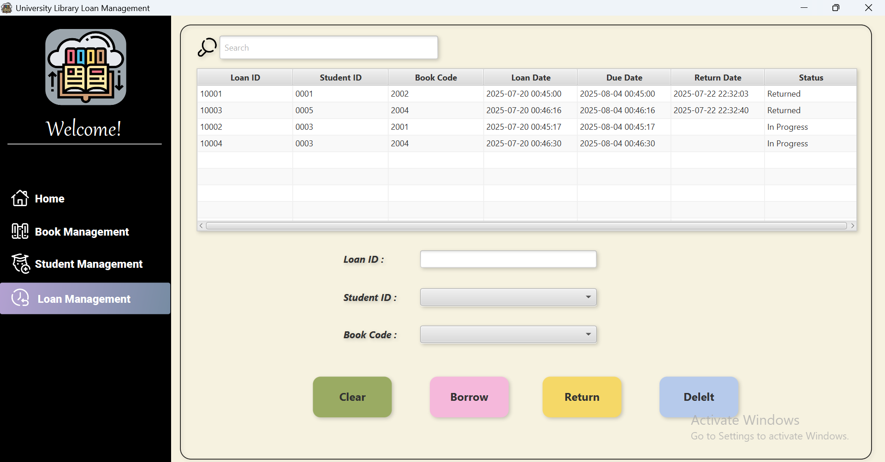

# 📚 University Library System

This is a simple University Library Loan System built using **JavaFX** and **SQLPlus**, as a university project.

---

## 🖼️ Screenshots

### 🏠 Home Page

### 📚 Books Page

### 👩‍🎓 Students Page

### 📄 Loan Page

---

## 🛠️ Tech Used

- Java
- JavaFX (SceneBuilder)
- SQLPlus
- IntelliJ IDEA
