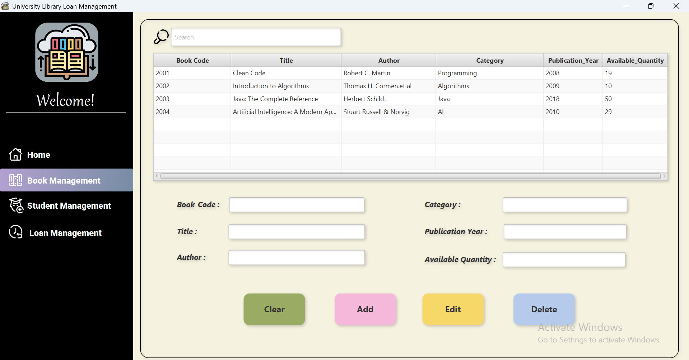
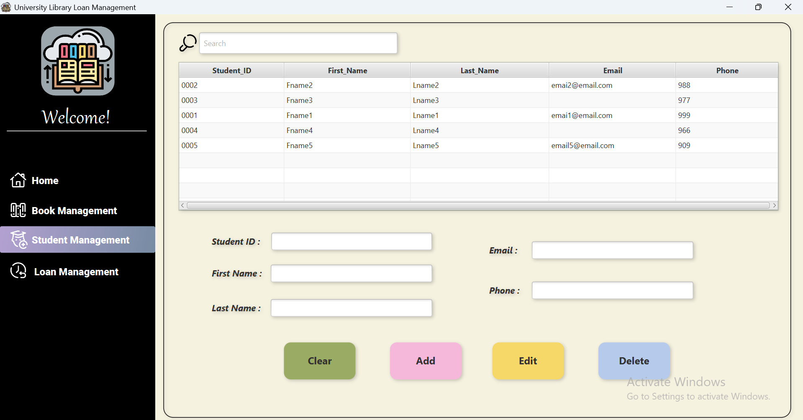

# 📚 University Library System

This is a simple University Library Loan System built using **JavaFX** and **SQL (Oracle SQLPlus)**, as a university project.

---

## 🧩 Features

- 📖 Add, edit, and delete books from the library database
- 👨‍🎓 Register and manage student information
- 🔄 Handle book loan and return operations
- 🗃 View book and student lists dynamically
- 💾 All data is stored and retrieved using SQLPlus

---

## 🖼️ Screenshots

### 🏠 Home Page


### 📚 Books Page


### 👩‍🎓 Students Page


### 📄 Loan Page


---

## 🛠️ Technologies Used

- **Java** – Main programming language  
- **JavaFX (FXML + SceneBuilder)** – UI development  
- **Oracle SQLPlus** – Used to run the database script manually  
- **ojdbc11.jar** – Oracle JDBC driver  
- **rs2xml.jar** – For displaying database records in JavaFX tables  
- **IntelliJ IDEA** – IDE used for development
- No CSS used

---

## 🗃️ Database

- Database schema is defined in [`resources/sql/Lib.sql`](resources/sql/Lib.sql).
- **To run the database:**
  1. Open **SQLPlus**
  2. Copy the content of the `.sql` file and paste it there
  3. Execute the script to create the required tables

---

## 📥 External Libraries
- [`ojdbc11.jar`](https://www.oracle.com/database/technologies/appdev/jdbc-downloads.html) – Oracle JDBC driver
- [`rs2xml.jar`](https://sourceforge.net/projects/finalangelsanddemons/files/rs2xml.jar/download) – For displaying ResultSet in JTable
- [`JavaFX SDK`](https://openjfx.io/) – UI framework used with SceneBuilder

---

## 📂 Project Structure
```
Unv_Library_App/
│
├───screenshots/
├───src/
│   ├───main/
│   │   ├───java/
│   │   │   └───library/
│   │   │       ├───database/
│   │   │       │   ├─── BookDataBase.java
│   │   │       │   ├─── HomeDataBase.java
│   │   │       │   ├─── LoanDataBase.java
│   │   │       │   ├─── SqlConnection.java
│   │   │       │   └─── StudentDataBase.jave
│   │   │       ├───model/
│   │   │       │   ├─── Book.java
│   │   │       │   ├─── Loan.java
│   │   │       │   └─── Student.java
│   │   │       ├─── Controler.java
│   │   │       └─── Main.java
│   │   └───resources/
│   │       ├───fxml/
│   │       │   └── LibraryApp.fxml
│   │       ├───icon/
│   │       └───sql/
│   │           └── Lib.sql
│   
└── README.md
```
